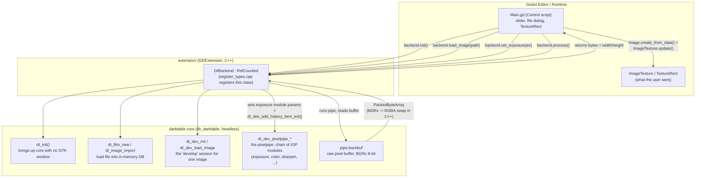

## Darktable Godot POC

This proves out the core bet of the whole project: can Godot drive darktable's
real image-processing engine (the "pixelpipe"), in-process, fast enough to feel
like a live editor? Concretely: open a RAW/image file, drag an exposure
slider, see the preview update from darktable's actual processing code (not a
fake/simulated adjustment).

**Answer so far: yes.** darktable's core (`lib_darktable`) can run fully
headless (no GTK window) inside a Godot process, and GDScript can call into it
directly through a small C++ shim. See `docs/init_plan.md` for the original
feasibility writeup this was based on.

### The big idea: two languages, one process

Godot doesn't know anything about RAW photo processing, and darktable doesn't
know anything about Godot. We bridge them with a **GDExtension**: a small
C++ class (`DtBackend`) that both sides can talk to.

- Godot (GDScript) calls plain methods on `DtBackend`, like
  `backend.set_exposure(1.5)`.
- `DtBackend` translates each call into the *actual* darktable C API calls
  that darktable's own headless tools (`darktable-cli`, `darktable-mcp`) use
  internally.
- Everything runs in a single process, single memory space. No sockets, no
  IPC, no serialization of image data across a process boundary. GDScript
  calls a function; C++ calls into darktable; pixels come back as bytes
  Godot can render immediately.

### Diagram

### Walking through one interaction: dragging the exposure slider

1. **`Main.gd`** (`project/Main.gd`) owns the UI: a `TextureRect` for the
   preview, an `HSlider` for exposure, an "Open" button + `FileDialog`.
   On startup it creates one `DtBackend` instance and calls `.init()`.
2. **`DtBackend.init()`** (`extension/src/dt_backend.cpp`) calls darktable's
   `dt_init()` with `init_gui = FALSE` — this is the exact flag that skips
   every GTK call inside darktable's startup. This is the same trick
   `darktable-cli` and `darktable-mcp` use to run darktable with no window.
3. **Opening a file** calls `backend.load_image(path)`, which imports the
   file into a throwaway in-memory darktable library (`--library :memory:`,
   so it never touches your real darktable catalog), loads it into a
   `dt_develop_t` (a "develop session," darktable's in-memory representation
   of one image being edited), and builds a **pixelpipe**: an ordered chain
   of image-processing modules (IOPs) like exposure, color, sharpening, etc.
4. **Dragging the slider** fires `_on_exposure_slider_value_changed()` in
   GDScript, which calls `backend.set_exposure(ev)`. This finds the
   `exposure` module already sitting in the pipe, writes the new EV value
   straight into its params struct, and calls
   `dt_dev_add_history_item_ext()` — the headless equivalent of "commit this
   edit," used instead of the GUI-only version that no-ops without a window.
5. GDScript then queues `backend.process()` on a **worker thread**
   (`WorkerThreadPool`), because running the pipeline takes real time and
   Godot's rendering calls must stay off the render-blocking main thread. The
   pipeline reruns only the modules affected by the change (darktable caches
   unchanged stages).
6. The result lands in `pipe.backbuf`, a flat buffer of raw pixels. `DtBackend`
   locks a mutex, copies it out, swaps byte order (darktable's internal format
   is BGRx; Godot wants RGBA), and hands it back as a `PackedByteArray`.
7. Back on the **main thread** (via `call_deferred`), GDScript wraps those
   bytes in an `Image`, then updates the `ImageTexture` shown in the
   `TextureRect`. That's the frame the user sees.

If a new slider value comes in while a frame is still processing, GDScript
remembers it and kicks off the next `process()` as soon as the current one
finishes, so drags stay responsive instead of queuing up a backlog.

### What lives where

| Path | What it is |
|---|---|
| `extension/src/dt_backend.h` / `.cpp` | The `DtBackend` C++ class: the only code that calls darktable's C API directly |
| `extension/src/register_types.cpp` | Boilerplate that registers `DtBackend` as a class GDScript can see |
| `extension/SConstruct` | Build script: links the shim against godot-cpp and darktable's built `lib_darktable` |
| `extension/godot-cpp/` | Vendored submodule: Godot's official C++ bindings, lets C++ talk to the Godot API |
| `project/Main.gd` | All UI/interaction logic, in GDScript |
| `project/Main.tscn` | The scene: `TextureRect` + sliders + buttons, wired to `Main.gd` |
| `project/dt_backend.gdextension` | Tells Godot where to find the compiled shim library per platform |
| `docs/DARKTABLE_API_NOTES.md` | Reference notes on the exact darktable API calls used above |
| `docs/init_plan.md` | Original feasibility spike plan (what's possible / not, and why) |

### One process-wide gotcha worth knowing

darktable's core state (image cache, mipmap cache, etc.) is a single global
per process, not something you can spin up multiple independent instances of.
`DtBackend` is built around that: it holds exactly **one image/session at a
time**. That's fine for this PoC; a real multi-document editor would need to
either serialize sessions through one darktable core or run multiple
processes, a decision to make later, not now.

### Known rough edges (see code comments for specifics)

- Texture-update performance on some Godot 4.x versions has a documented
  slowness regression; fine for a slider-drag PoC, would need a debounce or
  lower-res preview pipe for production.
- The extension is currently built for `arm64` only (matches this machine's
  Homebrew-built darktable); a universal build isn't set up.
- `dt_backend.gdextension`'s `compatibility_minimum` is pinned conservatively
  because godot-cpp doesn't yet have a branch matching the installed Godot
  4.6 beta editor exactly, see the comments in that file.

### FAQ

**When I move the exposure slider, is the new image coming straight from the
darktable lib, or is Godot faking it?**

Straight from darktable. Every slider change triggers `set_exposure()` then
`process()` (`dt_backend.cpp:185-275`), which re-runs the real pixelpipe,
the same `exposure` IOP module darktable's own darkroom uses, and reads the
result back out of `pipe.backbuf`. There is no brightness filter or shortcut
living in GDScript or in the shim; Godot only ever displays bytes that came
out of darktable's processing code.

**Am I seeing 100% full quality?**

Full resolution, yes. Full bit depth, not quite. The pipe is the "full" pipe
(`dt_dev_pixelpipe_init()`, the same one used by darktable's own darkroom
view), sized to the image's actual `iwidth`/`iheight`, not a downscaled
proxy. But `process()` calls `dt_dev_pixelpipe_process()`, the 8-bit
gamma/display path, not the float `_no_gamma()` path. So every module
computes in full float precision internally, but the final buffer you see
has been quantized to 8-bit RGBA for display, same tradeoff darktable
itself makes for interactive editing. It is not the same buffer darktable
would produce for a final export (export uses a different pipe init and can
go float/16-bit output).

**Where does the image actually live while it's being edited?**

Four separate copies, at four separate stages:

1. **Disk**: the original file, never touched or overwritten.
2. **darktable's mipmap cache (RAM)**: `dt_mipmap_cache_get(..., DT_MIPMAP_FULL, ...)`
   pulls a full-resolution, demosaiced float buffer, the actual pixel
   source the pipe reads from.
3. **The pipe (`dt_dev_pixelpipe_t`)**: per-module intermediate buffers as
   it runs through exposure/color/etc (cached so unrelated stages aren't
   recomputed), plus `pipe.backbuf`, the final 8-bit output.
4. **Godot**: `process()` copies `backbuf` into a `PackedByteArray` (with a
   BGRx-to-RGBA byte swap), which GDScript wraps into an `Image`/
   `ImageTexture` for the GPU to display, a fourth, independent copy.

The edit itself (the EV value) is not stored with any of those pixel
buffers. It lives in `dev.iop`'s params struct plus the history stack
(`dt_dev_add_history_item_ext`), pixels are regenerated from that recipe
every time `process()` runs, nothing is edited in place. Also worth
flagging: nothing here writes to disk, so closing the PoC without an
export step currently loses the edit entirely.
