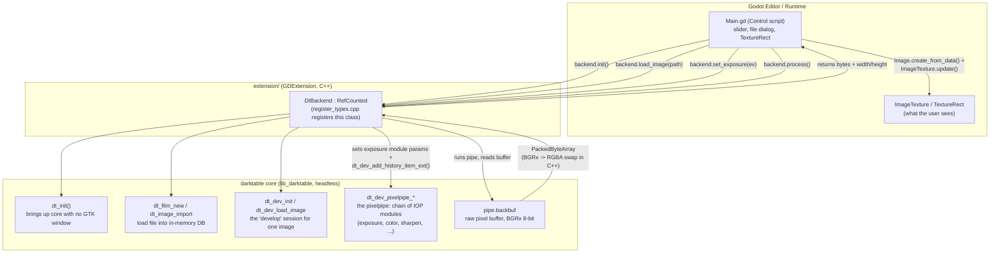

## Luxe

This proves out the core bet of the whole project: can Godot drive darktable's
real image-processing engine (the "pixelpipe"), in-process, fast enough to feel
like a live editor? Concretely: open a RAW/image file, drag an exposure
slider, see the preview update from darktable's actual processing code (not a
fake/simulated adjustment).

**Answer so far: yes.** darktable's core (`lib_darktable`) can run fully
headless (no GTK window) inside a Godot process, and GDScript can call into it
directly through a small C++ shim. See `docs/init_plan.md` for the original
feasibility writeup this was based on.

### Setup: linking against your own darktable build

**This repo does not vendor darktable.** `godot-poc/extension/` is a thin C++
shim (`dt_backend.cpp`/`.h`) that `#include`s darktable's headers and links
against darktable's compiled shared library, both of which live outside
`godot-poc/`, in `../source/` at the repo root. If you clone this repo, you
still need to build darktable yourself first (see `docs/build-darktable.md`)
before the GDExtension will compile or run.

Concretely, the layout this expects is:

```
darktable/                       <- repo root
├── source/                      <- darktable's own source checkout
│   ├── src/                     <- headers dt_backend.cpp #includes
│   └── build/                   <- darktable's CMake build output
│       ├── bin/libdarktable.dylib
│       ├── share/darktable/     <- runtime data files (color profiles, etc)
│       └── lib/darktable/       <- IOP module .so/.dylib plugins
└── godot-poc/
    └── extension/                <- the GDExtension shim (this dir)
```

`extension/SConstruct` needs to know where your `source/` and `source/build/`
are. It has sane defaults (assuming the layout above, siblings of
`godot-poc/`), but if your checkout is laid out differently, override these
on the `scons` command line:

| Variable       | What it points to                                                                                                                                                   | Default                                       |
| -------------- | ------------------------------------------------------------------------------------------------------------------------------------------------------------------- | --------------------------------------------- |
| `dt_src_dir`   | darktable's `src/` directory (has `common/`, `develop/`, `imageio/`, `iop/`, ...) — needed so `dt_backend.cpp` can `#include "common/darktable.h"` etc.             | `../../source/src` (relative to `extension/`) |
| `dt_build_dir` | darktable's CMake build directory — where CMake drops both generated headers (`config.h`, `version_gen.h`, ...) and the built `lib_darktable` shared library itself | `../../source/build`                          |
| `dt_lib_name`  | Name of the darktable shared library to link against (minus the `lib` prefix/extension)                                                                             | `darktable`                                   |

Example, if darktable lives somewhere else entirely:

```bash
cd godot-poc/extension
scons arch=arm64 \
  dt_src_dir=/path/to/darktable-src/src \
  dt_build_dir=/path/to/darktable-src/build
```

As of PORTABILITY_PLAN.md Phase 1, `--datadir`/`--moduledir` are no longer
baked in as compile-time constants — `dt_backend.cpp`'s `init()` computes them
at runtime instead (env var override → bundle-relative via Godot's own
executable path → `dladdr()`-relative fallback; see `DtBackend::compute_dt_dirs()`).
For local dev, set `DT_BACKEND_DATADIR`/`DT_BACKEND_MODULEDIR` env vars (e.g.
to `<dt_build_dir>/share/darktable` and `<dt_build_dir>/lib/darktable`) before
running the Godot editor, since neither of the other two candidates resolves
in the in-editor dev loop today (no bundle layout exists on disk yet).
`godot-poc/project/Main.gd`'s `_configure_dt_backend_env()` sets these env vars
automatically from `project.godot`'s `[dt_backend]` section (or a hardcoded
`res://../../source/build/{share,lib}/darktable` default if unset) so you don't
normally need to export them by hand for in-editor dev — **but that function
only runs under `OS.has_feature("editor")`** (PORTABILITY_PLAN.md 5.5: an
earlier version of this guard ran unconditionally and broke exported builds by
leaking a relative dev-tree path into `--datadir`, silently succeeding with the
wrong datadir and crashing darktable's rawspeed camera-metadata loader). Do not
remove or weaken that guard without re-reading 5.5 first.

One absolute path is still baked in at build time (dependency bundling,
Phase 2, isn't done yet):

- **The dylib rpath** (`-Wl,-rpath,<dt_build_dir>/bin`) — the shim finds
  `libdarktable.dylib` at runtime via this hardcoded dev-loop path. A second,
  bundle-relative rpath (`-Wl,-rpath,@loader_path`) is also linked in and will
  resolve once Phase 2 copies `libdarktable.dylib` next to `libdt_backend`
  inside an exported `.app`; both coexist since dyld tries each `LC_RPATH` in
  order.

There's also `dt_link_flags.json` (checked into `extension/`), a generated
file listing ~67 include paths, link libs, and 43 preprocessor `-D` defines
extracted from darktable's own CMake build (`compile_commands.json` +
`build.ninja`). These defines matter for correctness, not just compiling —
darktable's headers put struct fields behind `#ifdef HAVE_OPENCL` / `USE_LUA`
/ etc, so a mismatched define set silently shifts struct field offsets rather
than failing to compile. **If you rebuild darktable with different CMake
options than whoever generated this file, regenerate it** — see
`docs/build-darktable.md`, "regenerating dt_link_flags.json," for the exact
commands.

**Portability note:** the app can now actually be exported and run standalone.
A compiled `libdt_backend` and `libdarktable.dylib` together pull in ~190
transitive Homebrew `.dylib` dependencies (glib, gtk+3, cairo, exiv2, opencv,
etc.) that resolve to absolute `/opt/homebrew/...` paths, plus a ~166-file
moduledir of IOP/format/storage plugin `.so`s with their own such
dependencies, plus lensfun's separately-packaged camera/lens database.
`godot-poc/scripts/bundle_darktable_deps.sh` (Phase 2, extended during Phase 3
execution) copies all of it into an exported `.app`'s `Contents/Frameworks/`
and `Contents/Resources/darktable/`, and rewrites every load command to
`@loader_path`. This has been verified against a real Godot export
(`export_presets.cfg` now configured, Phase 3 done) — including a real
`sudo mv /opt/homebrew /opt/homebrew.disabled-for-test` test on this machine,
which confirmed live exposure editing works from the moved, bundled `.app`
with Homebrew genuinely absent. See `PORTABILITY_PLAN.md` section 5 for the
full history (several real bugs were only found once a real export existed to
test against) and its current status. For local dev (not exporting), every
developer working on this repo still needs their own local darktable build
and must point `dt_build_dir`/`dt_src_dir` at it if their layout differs from
the default, plus set
`DT_BACKEND_DATADIR`/`DT_BACKEND_MODULEDIR` env vars before running (see
above).

### The big idea: two languages, one process

Godot doesn't know anything about RAW photo processing, and darktable doesn't
know anything about Godot. We bridge them with a **GDExtension**: a small
C++ class (`DtBackend`) that both sides can talk to.

- Godot (GDScript) calls plain methods on `DtBackend`, like
  `backend.set_exposure(1.5)` or `backend.export_image("out.jpg")`.
- `DtBackend` translates each call into the _actual_ darktable C API calls
  that darktable's own headless tools (`darktable-cli`, `darktable-mcp`) use
  internally.
- Everything runs in a single process, single memory space. No sockets, no
  IPC, no serialization of image data across a process boundary. GDScript
  calls a function; C++ calls into darktable; pixels come back as bytes
  Godot can render immediately.

### Diagram



### Walking through one interaction: dragging the exposure slider

1. **`Main.gd`** (`project/Main.gd`) owns the UI: a `TextureRect` for the
   preview, an `HSlider` for exposure, an "Open" button + `FileDialog`.
   On startup it creates one `DtBackend` instance and calls `.init()`.
2. **`DtBackend.init()`** (`extension/src/dt_backend.cpp`) calls darktable's
   `dt_init()` with `init_gui = FALSE` — this is the exact flag that skips
   every GTK call inside darktable's startup. This is the same trick
   `darktable-cli` and `darktable-mcp` use to run darktable with no window.
3. **Opening a file** calls `backend.load_image(path)`, which imports the
   file into a throwaway in-memory darktable library (`--library :memory:`,
   so it never touches your real darktable catalog), loads it into a
   `dt_develop_t` (a "develop session," darktable's in-memory representation
   of one image being edited), and builds a **pixelpipe**: an ordered chain
   of image-processing modules (IOPs) like exposure, color, sharpening, etc.
4. **Dragging the slider** fires `_on_exposure_slider_value_changed()` in
   GDScript, which writes the new EV into the `_params` dict and calls
   `_request_render()`. On the render, `_apply_params_to_backend()` calls
   `backend.set_exposure(ev)`. This finds the
   `exposure` module already sitting in the pipe, writes the new EV value
   straight into its params struct, and calls
   `dt_dev_add_history_item_ext()` — the headless equivalent of "commit this
   edit," used instead of the GUI-only version that no-ops without a window.
   `_apply_params_to_backend()` pushes **only the params that changed** since
   the last apply (tracked in `_applied_params`), so a single slider tick
   appends one history item, not nine: see "Known rough edges" below.
5. GDScript then queues `backend.process_fit(w, h)` on a **worker thread**
   (`WorkerThreadPool`), where `w, h` is the `TextureRect`'s current on-screen
   pixel size, because running the pipeline takes real time and Godot's
   rendering calls must stay off the render-blocking main thread. The
   pipeline reruns only the modules affected by the change (darktable caches
   unchanged stages), and now renders at the capped viewport resolution
   instead of full sensor resolution (see "Interactive preview is now a
   capped-resolution proxy" below).
6. The result lands in `pipe.backbuf`, a flat buffer of raw pixels. `DtBackend`
   locks a mutex, copies it out, swaps byte order (darktable's internal format
   is BGRx; Godot wants RGBA), and hands it back as a `PackedByteArray`.
7. Back on the **main thread** (via `call_deferred`), GDScript wraps those
   bytes in an `Image`, then updates the `ImageTexture` shown in the
   `TextureRect`. That's the frame the user sees.

If a new slider value comes in while a frame is still processing, GDScript
remembers it and renders once more with the latest values when the current run
finishes, so drags stay responsive instead of queuing up a backlog. That
follow-up is paced by an adaptive EWMA gate (see "Known rough edges" below), not
a fixed debounce: cheap renders start essentially immediately, expensive ones
space starts by half the averaged runtime, and the trailing render always uses
the final slider value.

### What lives where

| Path                                  | What it is                                                                                                                                                                                                                    |
| ------------------------------------- | ----------------------------------------------------------------------------------------------------------------------------------------------------------------------------------------------------------------------------- |
| `extension/src/dt_backend.h` / `.cpp` | The `DtBackend` C++ class: the only code that calls darktable's C API directly                                                                                                                                                |
| `extension/src/register_types.cpp`    | Boilerplate that registers `DtBackend` as a class GDScript can see                                                                                                                                                            |
| `extension/SConstruct`                | Build script: links the shim against godot-cpp and darktable's built `lib_darktable`                                                                                                                                          |
| `extension/godot-cpp/`                | Vendored submodule: Godot's official C++ bindings, lets C++ talk to the Godot API                                                                                                                                             |
| `project/Main.gd`                     | All UI/interaction logic, in GDScript                                                                                                                                                                                         |
| `project/Main.tscn`                   | The "luxe" scene shell: top bar / image canvas / right adjustments panel / status bar, wired to `Main.gd` (see _The luxe UI shell_ below)                                                                                     |
| `project/main_theme.tres`             | The dark-neutral `Theme` resource applied on the root; greys are R=G=B so the chrome never biases perceived image color, with one muted-blue accent                                                                           |
| `project/light_theme.tres`            | Light counterpart to `main_theme.tres`; same StyleBoxFlat/type structure with inverted greys so both themes stay in lock-step |
| `project/ThemeManager.gd`             | Autoload singleton: owns both `Theme` resources, swaps `Main`'s root `theme` property (cascades to every child), persists the choice to `user://settings.cfg` |
| `project/dt_backend.gdextension`      | Tells Godot where to find the compiled shim library per platform                                                                                                                                                              |
| `scripts/bundle_darktable_deps.sh`    | Phase 2 of `PORTABILITY_PLAN.md`: copies `libdarktable.dylib` + its full transitive Homebrew dependency tree into an exported `.app` and rewrites load commands to `@loader_path`, so the app runs with no Homebrew installed |
| `scripts/smoke_test.sh` + `project/tests/smoke_test.gd` | Headless functional smoke test (see _Smoke test_ below): renders one RAW at two EV values through `DtBackend` and asserts two valid, content-different PNGs. The acceptance oracle for the GTK-free work (`docs/GTK-FREE-PLAN.md`) |
| `docs/DARKTABLE_API_NOTES.md`         | Reference notes on the exact darktable API calls used above                                                                                                                                                                   |
| `docs/init_plan.md`                   | Original feasibility spike plan (what's possible / not, and why)                                                                                                                                                              |
| `hooks/pre-commit` + `scripts/install-hooks.sh` | Pre-commit gate: if a commit touches the GDExtension's sources (`extension/src`, `SConstruct`, `dt_link_flags.json`) and the built framework in `project/bin/` is stale, it runs `scons` and aborts the commit on build failure (bypass: `git commit --no-verify`). Run `scripts/install-hooks.sh` once after cloning to wire it into `.git/hooks/` |

### Smoke test

`scripts/smoke_test.sh` is the fast, automated check that the darktable pixel
pipeline still works end-to-end. It renders one RAW at two exposure values
through the real `DtBackend` GDExtension (Godot `--headless --script`) and
asserts the two outputs are both valid PNGs **and** differ in content:

```bash
godot-poc/scripts/smoke_test.sh                 # auto-discovers a RAW
godot-poc/scripts/smoke_test.sh /path/to/x.ARW  # or pin one
# args: [RAW] [DT_BUILD_DIR] [OUT_DIR] [GODOT_BIN]; env: DT_SMOKE_RAW/EV1/EV2
```

Why through `DtBackend` and not `darktable-cli`: this is the exact acceptance
oracle `docs/GTK-FREE-PLAN.md` calls for (RAW → two EVs → two different PNGs).
A broken IOP `.so` that `dlopen`s but can't resolve a symbol mid-render fails
*here* and nowhere else in the dependency/leak audit chain. It needs only the
already-built **debug** framework (`project/bin/…template_debug.framework`), so
it runs in seconds and does not touch `export_standalone_app.sh` (that builds a
GUI `.app` you can't verify headless anyway).

Byte-identical outputs are treated as a failure: it means the exposure param
never reached the pipeline. Run it now to bank a "before" baseline, then re-run
after any GTK-free / dependency change to confirm no regression.

**GTK-free status (2026-09-17):** the smoke test PASSes against the
`USE_GUI=OFF` darktable build (`source/build-nogui`, pass its absolute path as
arg 2) with a `libdt_backend` that itself links no libgtk/libgdk
(`dt_link_flags.json` was regenerated from the OFF build). ON vs OFF renders are
pixel-identical (byte-identical lossless PFM). Details in
`docs/GTK-FREE-PLAN.md`; the flags-regeneration recipe (Makefiles-generator
variant) is in `docs/build-darktable.md`.

### Darktable modules (backlog + how to add one)

Darktable ships 91 image-operation (IOP) modules under `source/src/iop/*.c`. Each
is a pixelpipe stage the UI could expose. **To wire a new one into the app, use
the `add-darktable-module` skill** (`.claude/skills/add-darktable-module/`) — it
generalizes the exact pattern `exposure` was built with (redeclare the private
params struct → add a C++ backend setter + binding → add the GDScript UI + queued
render → rebuild the extension).

**Currently supported:** `exposure` (EV field), `colorbalancergb` (contrast
field), `shadhi` (shadows/highlights fields), `velvia` (strength, "Saturation"),
`vibrance` (amount), `channelmixerrgb` (chromatic-adaptation temperature,
driven by a single "White Balance (K)" Kelvin slider — see note below),
`tonecurve` (L-channel spline, via a custom curve-editing widget — see note
below), `clipping` (crop box only, via an interactive overlay — see note below).

**Note on White Balance:** white balance is implemented via `channelmixerrgb`
("color calibration")'s chromatic-adaptation transform, not the `temperature`
module. This app's default darktable workflow is scene-referred (sigmoid),
where `temperature` is pinned to a neutral preset (red/green/blue = 1/1/1)
and `channelmixerrgb` performs the real camera-to-D65 correction instead
(auto-applied in that workflow). `DtBackend::set_white_balance_temperature(
float kelvin)` sets `channelmixerrgb`'s `illuminant = DT_ILLUMINANT_D`,
`adaptation = DT_ADAPTATION_CAT16`, and `temperature = kelvin`; darktable's
own `illuminant_to_xy()` derives the correct chromaticity from the Kelvin
value at commit time, so — unlike the old temperature-based approach — this
is a real colorimetric CCT, not an artistic bias hack. `Main.gd` seeds the
slider on load from `get_white_balance_temperature()`, which reads back
`channelmixerrgb`'s own as-shot-derived default (see
`docs/DARKTABLE_API_NOTES.md` section F.3 for the full derivation and why
`temperature` is now left untouched). The `temperature` module itself is no
longer driven by this app at all.

**Note on the tone curve:** unlike every other supported module, `tonecurve`'s
meaningful field isn't a scalar — it's a variable-length array of `{x,y}`
control points (`dt_iop_tonecurve_params_t.tonecurve[0][]`, L channel only;
`a`/`b` channels are left at their introspection defaults). The UI drives it
with a dedicated `ToneCurveEditor` custom `Control`
(`project/ToneCurveEditor.gd`): click empty space to add a node, drag to move
one, right-click to delete (endpoints reset to `(0,0)`/`(1,1)` instead of being
removed, matching `tonecurve.c`), double-click to reset to the identity curve.
The widget draws its own monotone-cubic-Hermite interpolation for preview —
an independent reimplementation of the same interpolation family darktable's
`MONOTONE_HERMITE` curve type uses, not a call into darktable's own
`dt_draw_curve` code — so the on-screen curve may differ from the rendered
result by a hair at extreme node placements. `DtBackend::set_tonecurve()`
takes the whole point list every time and forces `tonecurve_type[0]` to
`MONOTONE_HERMITE` to match. See `docs/DARKTABLE_API_NOTES.md` section F for
the struct layout this depends on.

**Note on Crop:** crop drives the `clipping` module ("crop & rotate"), but only
its crop box — rotation, keystone, and aspect locking are left untouched. The
box is the module's `cx/cy/cw/ch` fields, which despite their names are the
normalized **left/top/right/bottom edges** (not x/y/width/height), 0..1
fractions of the whole image; the full frame (0, 0, 1, 1) disables the module
so a cleared crop costs nothing in the pipe. The UI is a toggle ("⛶ Crop") in
the top bar: opening it lifts the committed crop (the pipe renders the full
frame again) and shows a `CropOverlay` control over the displayed image with a
draggable/resizable rule-of-thirds box; Done commits the new box into
`_params["crop"]` and re-renders, Cancel restores the previous crop. Reopening
the overlay resumes from the committed box. Fraction-of-image coordinates mean
the same crop box applies identically at any edit resolution and to full-res
export. Rotation/keystone remain backlog.

The remaining modules are the backlog below. Prefer modules whose params are a
flat struct of scalars (like exposure); modules with masks, drawn shapes, spline
curves, or color pickers (`retouch`, `liquify`, `colorzones`, `rgbcurve`, `spots`,
`masks`, …) need real custom UI and are not simple slider wirings.

#### Tone

| Module          | Display name                   | Notes                                                                                                 |
| --------------- | ------------------------------ | ----------------------------------------------------------------------------------------------------- |
| `exposure` ✅   | exposure                       | Exposure / black point — **supported**                                                                |
| `filmicrgb`     | filmic rgb                     | Scene-referred tone mapping                                                                           |
| `filmic`        | filmic                         | Legacy filmic tone mapping                                                                            |
| `sigmoid`       | sigmoid                        | Scene-referred tone curve                                                                             |
| `agx`           | AgX                            | AgX display transform                                                                                 |
| `basecurve`     | base curve                     | Camera base tone curve                                                                                |
| `basicadj`      | basic adjustments              | Combined exposure/contrast/saturation                                                                 |
| `tonecurve` ✅  | tone curve                     | Manual tone curve — **L-channel spline UI supported** (see note above table)                          |
| `rgbcurve`      | rgb curve                      | Per-channel RGB curve (spline UI)                                                                     |
| `toneequal`     | tone equalizer                 | Zone-based tonal adjustment                                                                           |
| `levels`        | levels                         | Black/mid/white levels                                                                                |
| `rgblevels`     | rgb levels                     | Per-channel RGB levels                                                                                |
| `shadhi`        | shadows and highlights         | Shadow/highlight recovery — **shadows/highlights supported**                                          |
| `globaltonemap` | global tonemap                 | Global HDR tone mapping                                                                               |
| `zonesystem`    | zone system                    | Ansel Adams zone system                                                                               |
| `bilat`         | local contrast                 | Bilateral local contrast                                                                              |
| `clahe`         | old local contrast             | Legacy CLAHE local contrast                                                                           |
| `relight`       | fill light                     | Fill-light relighting                                                                                 |
| `lowlight`      | lowlight vision                | Scotopic low-light simulation                                                                         |
| `profile_gamma` | unbreak input profile          | Gamma/linearization fix                                                                               |
| `colisa`        | contrast brightness saturation | Basic CBS controls (deprecated upstream; superseded here by colorbalancergb)                          |

#### Color

| Module               | Display name         | Notes                                                                                                               |
| -------------------- | -------------------- | ------------------------------------------------------------------------------------------------------------------- |
| `colorbalancergb` ✅ | color balance rgb    | Scene-referred color balance — **contrast field supported**                                                         |
| `colorbalance`       | color balance        | Lift/gamma/gain                                                                                                     |
| `channelmixerrgb` ✅ | color calibration    | Channel mixer + chromatic adaptation (CAT16) — **`temperature`/`illuminant`/`adaptation` driven by the "White Balance (K)" Kelvin slider, supported** (see note above table) |
| `channelmixer`       | channel mixer        | RGB channel mixing                                                                                                  |
| `colorequal`         | color equalizer      | Hue/sat/lightness equalizer                                                                                         |
| `colorzones`         | color zones          | Adjust by hue/lightness/saturation zones (curve UI)                                                                 |
| `colorcontrast`      | color contrast       | a/b channel contrast                                                                                                |
| `colorcorrection`    | color correction     | Split-tone via a/b plane                                                                                            |
| `colorharmonizer`    | color harmonizer     | Color harmony adjustment                                                                                            |
| `colorchecker`       | color look up table  | Color LUT from checker chart                                                                                        |
| `colortransfer`      | color transfer       | Transfer palette between images                                                                                     |
| `colormapping`       | color mapping        | Map color characteristics between images                                                                            |
| `colorize`           | colorize             | Apply single color tint                                                                                             |
| `monochrome`         | monochrome           | B&W conversion with tint                                                                                            |
| `velvia` ✅          | velvia               | Saturation boost (Velvia film look) — **strength ("Saturation") supported**                                         |
| `vibrance` ✅        | vibrance             | Vibrance saturation — **amount supported**                                                                          |
| `splittoning`        | split-toning         | Shadow/highlight toning                                                                                             |
| `lut3d`              | LUT 3D               | Apply 3D LUT (.cube etc.)                                                                                           |
| `primaries`          | rgb primaries        | Adjust RGB primaries                                                                                                |
| `temperature`        | white balance         | White balance — no longer driven by this app; left untouched by darktable's own initialization (white balance is now implemented via `channelmixerrgb`, see above and note above table) |
| `colorin`            | input color profile  | Input ICC profile                                                                                                   |
| `colorout`           | output color profile | Output ICC profile                                                                                                  |

#### Correction

| Module                | Display name              | Notes                             |
| --------------------- | ------------------------- | --------------------------------- |
| `ashift`              | rotate and perspective    | Perspective correction            |
| `clipping` ⚠️         | crop and rotate           | **Crop supported** (rotate/keystone backlog) |
| `flip`                | orientation               | Flip/rotate orientation           |
| `enlargecanvas`       | enlarge canvas            | Extend canvas                     |
| `borders`             | framing                   | Add border/frame                  |
| `rotatepixels`        | rotate pixels             | Sensor pixel rotation             |
| `scalepixels`         | scale pixels              | Sensor pixel scaling              |
| `finalscale`          | scale into final size     | Final output resize               |
| `cacorrect`           | raw chromatic aberrations | Raw CA correction                 |
| `cacorrectrgb`        | chromatic aberrations     | RGB CA correction                 |
| `defringe`            | defringe                  | Purple fringing removal           |
| `hazeremoval`         | haze removal              | Dehaze                            |
| `colorreconstruction` | color reconstruction      | Recover clipped highlight color   |
| `highlights`          | highlight reconstruction  | Reconstruct blown highlights      |
| `hotpixels`           | hot pixels                | Remove hot pixels                 |
| `invert`              | invert                    | Invert (negatives)                |
| `negadoctor`          | negadoctor                | Color negative processing         |
| `spektrafilm`         | spektrafilm               | Film negative/spectral processing |
| `rawprepare`          | raw black/white point     | Raw black/white point + crop      |
| `demosaic`            | demosaic                  | Raw demosaicing                   |
| `gamma`               | display encoding          | Final display encoding            |

#### Denoise / sharpen (technical)

| Module             | Display name       | Notes                                 |
| ------------------ | ------------------ | ------------------------------------- |
| `denoiseprofile`   | denoise (profiled) | Profiled sensor denoise               |
| `nlmeans`          | astrophoto denoise | Non-local means denoise               |
| `rawdenoise`       | raw denoise        | Raw-domain denoise                    |
| `censorize`        | censorize          | Blur/pixelate for censoring           |
| `sharpen`          | sharpen            | Unsharp mask                          |
| `highpass`         | highpass           | Highpass filter                       |
| `lowpass`          | lowpass            | Lowpass blur                          |
| `diffuse`          | diffuse or sharpen | Diffusion-based sharpen/denoise       |
| `contrastntexture` | contrast & texture | Contrast/texture enhancement          |
| `atrous`           | contrast equalizer | Wavelet contrast equalizer (curve UI) |
| `equalizer`        | legacy equalizer   | Legacy wavelet equalizer              |

#### Effect

| Module        | Display name          | Notes                                     |
| ------------- | --------------------- | ----------------------------------------- |
| `bloom`       | bloom                 | Highlight bloom glow                      |
| `blurs`       | blurs                 | Lens/motion/gaussian blur                 |
| `soften`      | soften                | Orton-style softening                     |
| `grain`       | grain                 | Film grain                                |
| `vignette`    | vignetting            | Vignette                                  |
| `graduatednd` | graduated density     | Graduated ND filter                       |
| `watermark`   | watermark             | SVG watermark overlay                     |
| `overlay`     | composite             | Composite/overlay another image           |
| `rasterfile`  | external raster masks | External raster mask input                |
| `dither`      | dither or posterize   | Dithering/posterization                   |
| `liquify`     | liquify               | Warp/liquify (drawn UI)                   |
| `retouch`     | retouch               | Heal/clone with wavelet scales (drawn UI) |
| `spots`       | spot removal          | Clone/heal spots (drawn UI)               |

#### Pipeline indicators / output

| Module           | Display name    | Notes                           |
| ---------------- | --------------- | ------------------------------- |
| `overexposed`    | overexposed     | Overexposure clipping indicator |
| `rawoverexposed` | raw overexposed | Raw clipping indicator          |

_(Excluded as non-module helpers: `ashift_lsd.c`, `ashift_nmsimplex.c`,
`mask_manager.c`, and `useless.c` — the developer template. Source of truth:
`source/src/iop/*.c`.)_

### The luxe UI shell (`Main.tscn` / `main_theme.tres`)

The frontend is a dark, neutral editor shell (no per-node styling; a single
`Theme` resource on the root cascades to everything):

```
Root (VBoxContainer)
├─ TopBar (PanelContainer)      "luxe" wordmark · Open · Export · Theme toggle · | · Fit · ZoomSlider · %
├─ MiddleHBox (HBoxContainer)
│  ├─ Scroll → TextureRect      the image canvas (expands to fill)
│  └─ RightPanel (280px)        TONE → Exposure slider · VIEW → Edit resolution
└─ BottomBar (PanelContainer)   resolution readout (left) · transient status (right)
```

Dark is the default theme; the `ThemeButton` in the top bar (labelled "Light
Mode" / "Dark Mode" depending on the current state) calls
`ThemeManager.toggle_theme()`, which swaps `Main`'s root `theme` property
between `main_theme.tres` and `light_theme.tres` and writes the choice to
`user://settings.cfg` so it survives relaunch. Because every panel/button/label
in the scene relies on the shared `Theme` (no per-node color overrides), the
swap is a single assignment and repaints the whole shell instantly.

Layout is **container-only** (no manual positions): `MiddleHBox` expands
vertically; inside it `Scroll` expands horizontally while `RightPanel` is
fixed-width (`custom_minimum_size.x = 280`, shrink). `TopBar`/`BottomBar` shrink
to their content height. The theme defines `StyleBoxFlat`s for buttons,
panels, the slider track/fill, the `OptionButton` popup, and `Label`
variations (`Logo`, `GroupHeader`, `Muted`). Palette: canvas `#1c1c1c`, panels
`#252525`, text `#e0e0e0`, accent `#4a9de0`. One deliberate detail: the slider
grabber is a Godot `Texture2D` icon (not a `StyleBox`), so the accent is applied
to the filled track (`grabber_area`), left of the grabber, not the grabber
itself. Only the three real controls (Exposure, Edit resolution, Display zoom)
are surfaced; the right panel is grouped so future backend modules drop in as
new sections. `project.godot` uses `stretch/mode=canvas_items` +
`stretch/aspect=expand` with a 900x600 minimum window so the panel + canvas
stay usable.

### One process-wide gotcha worth knowing

darktable's core state (image cache, mipmap cache, etc.) is a single global
per process, not something you can spin up multiple independent instances of.
`DtBackend` is built around that: it holds exactly **one image/session at a
time**. That's fine for this PoC; a real multi-document editor would need to
either serialize sessions through one darktable core or run multiple
processes, a decision to make later, not now.

### Known rough edges (see code comments for specifics)

- **History-stack growth under continuous edits (fixed).**
  `_apply_params_to_backend()` used to call all nine backend setters on every
  render, regardless of which slider actually moved. Each setter calls
  `dt_dev_add_history_item_ext()`, and darktable only dedups history against
  the **last** item on the stack (which is always the crop item), so all nine
  appended a fresh item every tick: history grew by up to 9 items per slider
  tick and every render replayed the whole thing, which is why lag got worse
  the longer a drag lasted. It now pushes only params whose value changed since
  the last apply (a `_params` vs. `_applied_params` comparison, keyed per
  module); `_applied_params` is cleared on image load so the first render for a
  new image is still a full sync. A module added under the
  `.claude/skills/add-darktable-module` recipe keeps working with no extra
  bookkeeping: it just writes its `_params` key and gets a guarded setter call.
- **Adaptive render throttle (EWMA gate).** Live slider renders are paced by an
  exponential moving average of render latency (8-run EWMA, the same recurrence
  darktable's own UI gate uses at `source/src/develop/develop.c:294-298` and
  `628-633`). A new render only starts once half the averaged runtime has passed
  since the previous start, so cheap renders (`25%` edit res, cached pipe) stay
  near-instant while expensive ones collapse a drag's burst of ticks into fewer
  frames. It is not a fixed debounce: the window adapts to measured cost, and a
  deferred request arms a single reused one-shot `Timer` for exactly the
  remaining sliver, whose trailing render re-snapshots `_params` so the final
  slider value is never dropped. The single-in-flight + one-queued semantics are
  unchanged (see `Main.gd`'s `_request_render` / `_render_gate_open` /
  `_arm_render_gate_timer`).
- Texture-update performance on some Godot 4.x versions has a documented
  slowness regression; fine for a slider-drag PoC, would still benefit from a
  lower-res preview pipe for production.
- The extension is currently built for `arm64` only (matches this machine's
  Homebrew-built darktable); a universal build isn't set up.
- `dt_backend.gdextension`'s `compatibility_minimum` is pinned conservatively
  because godot-cpp doesn't yet have a branch matching the installed Godot
  4.6 beta editor exactly, see the comments in that file.
- The **library** DB is `:memory:` and the **config**/**cache** dirs are
  isolated: `init()` passes darktable `--configdir`/`--cachedir` pointing at
  `~/.cache/godot-darktable-poc/{config,cache}` instead of the real
  `~/.config/darktable`. Without this, darktable's config-DB (`data.db`) lock
  meant only one instance could run at a time (a headless test while the
  editor's Play session was open failed with "can't acquire database lock").
  With the sandbox, this extension never touches the user's real darktable
  config and no longer contends for that lock.

### FAQ

**When I move the exposure slider, is the new image coming straight from the
darktable lib, or is Godot faking it?**

Straight from darktable. Every slider change triggers `set_exposure()` then
`process()` (`dt_backend.cpp:185-275`), which re-runs the real pixelpipe,
the same `exposure` IOP module darktable's own darkroom uses, and reads the
result back out of `pipe.backbuf`. There is no brightness filter or shortcut
living in GDScript or in the shim; Godot only ever displays bytes that came
out of darktable's processing code.

**Am I seeing 100% full quality?**

Not by default anymore, and that's intentional (see next section): the
interactive preview now renders at a "fit" resolution capped to the visible
`TextureRect` size, not full sensor resolution. Full bit depth was never the
case either. The pipe is the "full" pipe (`dt_dev_pixelpipe_init()`, the same
one used by darktable's own darkroom view), fed the image's full demosaiced
buffer as _input_ (`DT_MIPMAP_FULL`, `iscale=1.0` -- this part is unchanged),
but `process_fit()` calls `dt_dev_pixelpipe_process()`, the 8-bit gamma/
display path, not the float `_no_gamma()` path, and asks it to render at a
capped _output_ scale (see below). So every module still computes in full
float precision internally on full-res input, but the final buffer you see
is both quantized to 8-bit RGBA and downscaled to fit the viewport, the same
kind of tradeoff darktable's own darkroom view makes for interactive editing
(develop.c's zoom/fit scale math). It is not the same buffer darktable would
produce for a final export (export uses a different pipe init, full
resolution, and can go float/16-bit output) -- **export is unaffected by any
of this and always renders full-resolution**, see "Exporting" below.

### Interactive preview is now a capped-resolution proxy ("fit view")

Rendering the full sensor resolution on every single edit (every slider
tick) was needlessly slow: the user can only ever see as many pixels as
their `TextureRect` is wide/tall, so darktable's pipe was doing 10-40x more
work than necessary per keystroke. This is now capped.

- `DtBackend::process_fit(max_width, max_height)` (`extension/src/
dt_backend.cpp`) replaces the old no-arg `process()`. It:
  1. Re-syncs the pipe and calls `dt_dev_pixelpipe_get_dimensions()` exactly
     as before, to get the image's native (scale=1.0) processed
     width/height. This call is scale-independent -- it always reports
     native dimensions regardless of what scale is used later.
  2. Computes `scale = min(max_width/native_w, max_height/native_h)`,
     clamped to a max of `1.0` (the proxy never upscales past native
     resolution -- mirrors export's own `upscale=FALSE`). This is darktable's
     own "fit" scale formula, `source/src/develop/develop.c:1066-1076`.
  3. Calls `dt_dev_pixelpipe_process(&pipe, &dev, 0, 0, out_w, out_h, scale,
DT_DEVICE_NONE)` with `out_w`/`out_h` = the scaled dimensions. Passing
     `scale` as the actual scale argument to `dt_dev_pixelpipe_process()` is
     the key change from the old code (which hardcoded `1.0f`, i.e. always
     full native resolution) -- this is exactly what darktable's own
     darkroom does before calling this same function
     (`source/src/develop/develop.c:874-890`).
  4. Reads back `pipe.backbuf` sized to `out_w * out_h` (not the native
     dimensions), and reports `get_width()`/`get_height()` as the actual
     rendered (scaled) dims so Godot builds its `Image` at the right size.
  - **The raw pixel _input_ is untouched**: `load_image()` still feeds the
    pipe the full `DT_MIPMAP_FULL` demosaiced buffer at `iscale=1.0`
    (`dt_backend.cpp:175`ish) -- only the _output_ render scale changed. This
    keeps demosaic/geometry/every module faithful; only the final rendered
    pixel count shrinks.
- `Main.gd` passes the `TextureRect`'s current on-screen pixel size
  (`Vector2i(texture_rect.size)`, read on the main thread since `Control`
  properties aren't worker-thread-safe, then handed into the worker task) as
  `max_width`/`max_height` on every render, including the initial one.
- The preview also now **re-renders on resize**: `texture_rect.resized`
  triggers a one-shot `Timer` (`ResizeDebounceTimer`, 150ms, added in
  `Main.tscn`) that's restarted on every `resized` signal, so a resize drag
  only fires one re-render after the drag settles, not one per frame of the
  drag. This reuses the exact same "pending render" queuing pattern as the
  exposure slider: if a render is already in flight when the debounce fires,
  it's queued instead of started twice.
- **Export is completely unaffected.** `export_image()` was not touched; it
  still goes through `dt_imageio_export_with_flags()` at full resolution
  with `upscale=FALSE`, `scale=1.0`, independent of whatever the preview's
  fit-scale happened to be.
- **Now implemented** (see "Two decoupled knobs" below): a generalized ROI
  render (`render_view()`) using the full `x`/`y`/`wd`/`ht` clamp math from
  `develop.c:874-890`. The UI drives it as a whole-image render at a chosen
  **edit resolution**, decoupled from a frontend-only **display zoom** +
  drag-to-pan.

### Zoom to 100% and a display-size dropdown

`process_fit()` only ever handles the case where the whole (scaled) image
fits inside the viewport -- `x=y=0`, `wd`/`ht` = the full scaled image, no
cropping. Once the user asks for a fixed zoom level (25% / 50% / 100% / 200%)
on an image whose scaled size exceeds the on-screen viewport, that
simplification breaks down: only a viewport-sized _region_ of the scaled
image can be rendered, and which region depends on where the user has
panned to. This needed the full ROI math darktable's own darkroom already
uses for exactly this (fit / 100% / arbitrary zoom are all one code path
there), `source/src/develop/develop.c:874-890`:

```
scale = zoom_scale * ppd;                 // ppd (HiDPI) fixed at 1.0 for now
pipe_width  = scale * pipe->processed_width;
pipe_height = scale * pipe->processed_height;
wd = MIN(window_width,  pipe_width);      // clip render region to viewport
ht = MIN(window_height, pipe_height);
x  = CLAMP(pipe_width  * (.5 + zoom_x) - wd/2, 0, pipe_width  - wd);
y  = CLAMP(pipe_height * (.5 + zoom_y) - ht/2, 0, pipe_height - ht);
dt_dev_pixelpipe_process(pipe, dev, x, y, wd, ht, scale, devid);
```

When `scale <= fit_scale`, `pipe_width <= viewport` so `wd = pipe_width`,
`x = 0`: the whole image renders (exactly what `process_fit()` already did).
When `scale > fit_scale` (e.g. 100% on a large image), only the
viewport-sized region renders, positioned by `zoom_x`/`zoom_y` (each in
`[-0.5, 0.5]`, `0,0` = centered).

#### `DtBackend::render_view()` -- the one render implementation

`extension/src/dt_backend.cpp`'s `render_view(viewport_w, viewport_h, scale,
center_x, center_y)` implements the math above directly:

1. `refresh_native_dimensions()` (factored out of the old `process_fit()`)
   dispatches any pending edit as an incremental pipe change (see
   "Incremental change dispatch" below), then calls
   `dt_dev_pixelpipe_get_dimensions()` once to get/cache the native
   (scale=1.0) `processed_width`/`processed_height` -- this call is
   scale-independent, so the cached value is reused by every subsequent
   render.
2. `pipe_w`/`pipe_h` = `scale * native_w`/`native_h`.
3. `wd`/`ht` = `min(viewport, pipe_dim)`.
4. `x`/`y` = `clamp(pipe_dim*(0.5+center) - dim/2, 0, pipe_dim - dim)`. When
   `wd == pipe_w` (image fits), `pipe_w - wd == 0`, so the clamp forces
   `x = 0` regardless of `center_x` -- panning is automatically a no-op
   whenever the image already fits, with no special-casing needed in the UI.
5. `dt_dev_pixelpipe_process(&pipe, &dev, x, y, wd, ht, scale, DT_DEVICE_NONE)`.
6. Reads `pipe.backbuf` under `backbuf_mutex`, BGRx->RGBA swap, sized to
   `wd*ht` (not the native or pipe-space size -- the backbuf only holds
   `wd*ht` pixels' worth of valid data after this call). `get_width()`/
   `get_height()` report `wd`/`ht`.

`process_fit(max_width, max_height)` is now a thin wrapper: it computes
`scale = min(1.0, min(max_width/native_w, max_height/native_h))` (the same
fit-scale formula as before, `develop.c:1066-1076`, still clamped to never
upscale) and delegates to `render_view(max_width, max_height, scale, 0, 0)`.
There is exactly one render implementation behind both entry points now.

#### Incremental change dispatch (`DtBackend::refresh_native_dimensions()`)

`refresh_native_dimensions()` used to call `dt_dev_pixelpipe_synch_all()`
before every render, which resets every piece hash and replays the entire
history, so per-render cost grew with history length and the pixelpipe cache
was largely defeated. It now dispatches only what changed:

- Each setter records the module it touched (`note_pipe_change()`).
- One changed module goes through darktable's own
  `dt_dev_pixelpipe_synch_top()`, which re-commits just the top history item
  (the module the setter just touched). Upstream cache lines survive; only the
  changed node and its downstream reprocess. This is the same incremental
  dispatch darktable's GUI uses for `DT_DEV_PIPE_TOP_CHANGED`.
- Two or more changed modules before one render (Main.gd pushes all params on
  image load; coalesced slider moves can arrive together) cannot be expressed
  as a top-item change, so that case, plus a module whose enabled state flips,
  falls back to `dt_dev_pixelpipe_synch_all()`.

These setters must keep `dt_dev_add_history_item_ext(..., no_image=TRUE)`:
with `gui_attached=FALSE` darktable never allocates `dev->full.pipe`/
`preview_pipe` (`develop.c:101-116`), so the `!no_image` branch that ORs
`DT_DEV_PIPE_*_CHANGED` onto them (`develop.c:1404-1410`, `1432-1437`) would
dereference NULL. The bridge therefore tracks the change itself.

`get_native_width()`/`get_native_height()` expose the cached native (scale=1.0)
dimensions to GDScript (populated by the last `process_fit()`/`render_view()`
call). The UI needs these to work out, for a given zoom percentage, whether
the scaled image exceeds the current viewport and therefore whether panning
should be active -- without having to render first just to find out.

#### Two decoupled knobs: edit resolution vs. display zoom (`Main.tscn` / `Main.gd`)

The UI now separates _what resolution the pipeline computes at_ from _how big
that result is drawn on screen_ -- two independent dropdowns in a `ViewRow`
below the exposure slider:

1. **Edit resolution** (`EditResOptionButton`): **100%** (default), **75%**,
   **50%**, **25%** of native. This is the backend/proxy knob -- the scale
   darktable actually processes the **whole** image at. Changing it re-runs the
   pipe. `Main.gd`'s `_edit_scale` holds the fraction; `_EDIT_MODES` maps item
   ids to it.
2. **Display zoom** (top-bar `ZoomSlider` + `FitButton`): a **continuous**
   percentage from 10% to 400%, relative to _native_ pixels (100% display = 1
   native px per screen px), plus a **Fit** toggle (default on). This is a
   **frontend-only** knob -- it resizes the `TextureRect` and never touches the
   pipe. `_display_zoom` holds the fraction (`-1.0` = Fit sentinel). Because the
   slider can't encode Fit, the sentinel lives only in `_display_zoom` and is
   mirrored in the UI: `FitButton` pressed + `ZoomValueLabel` reading "Fit".
   Dragging the slider drops out of Fit (`_on_zoom_slider_value_changed`);
   clicking Fit re-engages it (`_on_fit_button_toggled`). Both share the
   `_apply_zoom_change()` tail. (This replaced the old discrete
   `DisplayZoomOptionButton` dropdown.)

**Edit resolution render.** `_process_task()` renders the whole image at
`_edit_scale` in a single call: `render_view(_WHOLE_IMAGE_VIEWPORT,
_WHOLE_IMAGE_VIEWPORT, _edit_scale, 0, 0)`. The oversized viewport
(`1000000`) forces `render_view()`'s `wd = MIN(viewport, pipe_w)` clamp to
resolve to `pipe_w` -- i.e. the entire scaled image, no crop, `x=y=0` -- and
because `render_view()` only allocates the clipped ROI (`wd*ht`), the huge
number costs nothing. The frontend no longer calls `process_fit()` at all (it
still exists in the backend, now unused by the UI); "fit" is a display concern,
not a render one. This is what makes edit resolution **viewport-independent**:
a window resize no longer re-runs the pipe.

Edit-resolution changes and exposure-slider drags share the same
`_processing`/`_has_pending_ev` in-flight-render queue -- no second,
possibly-overlapping render path, since darktable's pipe is process-wide global
state and concurrent `dt_dev_pixelpipe_process()` calls are not safe.

**Display layout** (`_apply_display_layout()`, frontend-only, no pipe). The
`TextureRect` lives inside a `ScrollContainer` (`Root/MiddleHBox/Scroll`):

- **Fit**: `stretch_mode = KEEP_ASPECT_CENTERED`, `custom_minimum_size =
scroll_container.size` -> the whole image is letterboxed and centered in the
  pane, no scrollbars.
- **Fixed zoom**: `stretch_mode = STRETCH_SCALE`, `custom_minimum_size =
native * _display_zoom` -> exact on-screen pixel size. When that exceeds the
  pane the `ScrollContainer` shows scrollbars; when smaller it anchors
  top-left (acceptable PoC cosmetic).

Changing display zoom just calls `_apply_display_layout()` + refreshes the
label -- instant, no re-render. A pane resize (`scroll_container.resized`) also
only re-lays-out (Fit's on-screen size depends on the pane). Note the pane is
now the space left of the fixed-width right panel inside `MiddleHBox`, but the
Fit math still reads `scroll_container.size`, so it stays correct.

**The quality tradeoff, surfaced in the label.** Because the two knobs are
independent, the on-screen result can be a low-res buffer stretched up: the
buffer holds `_edit_scale * native` pixels but is drawn at `_display_zoom *
native`, so each buffer pixel is stretched by `_display_zoom / _edit_scale`.
`_update_resolution_label()` reports this: `> 1` prints `[upscaled Nx — soft]`;
both knobs at 100% prints `[1:1 native pixels]`. Example readout:

```
Native 6000x4000  |  Editing @ 50% (buffer 3000x2000)  |  Display 100% → 6000x4000 on screen  [upscaled 2.0x — soft]
```

True per-pixel detail requires **both** edit resolution and display zoom at
100%. This is the intended workflow: edit fast at a low proxy resolution, bump
edit resolution to 100% only when pixel-peeping.

#### Drag-to-pan

When a fixed display zoom renders the image larger than the pane, dragging the
mouse over the preview pans it. `texture_rect.gui_input` (connected in
`_ready()`) drives `_on_texture_rect_gui_input()`: left-button press/release
toggles `_dragging`; motion while dragging subtracts `event.relative` from
`scroll_container.scroll_horizontal`/`scroll_vertical`. This is pure frontend
scrolling (no re-render), and it's inert when the image fits (scroll values
clamp to 0), so no `_pan_active()` guard is needed anymore.

#### Known follow-ups intentionally left out

- No HiDPI/`ppd` (pixel-density) scaling -- `render_view()` hardcodes
  `ppd = 1.0`. A Retina display would want `scale = zoom_scale * ppd` per
  `develop.c:874`.
- No scroll-wheel zoom, no keyboard shortcuts for the zoom slider or edit-res
  dropdown.
- Fixed display zooms smaller than the pane anchor top-left rather than
  centering (a `ScrollContainer` limitation for sub-viewport content).
- The whole image is rendered at edit resolution even when Fit only needs a
  small buffer; at edit 100% on a large RAW that is a full-native buffer +
  texture. This is the deliberate cost of making display zoom/pan a free
  frontend operation (render once, zoom around without re-running the pipe).

**Where does the image actually live while it's being edited?**

Four separate copies, at four separate stages:

1. **Disk**: the original file, never touched or overwritten.
2. **darktable's mipmap cache (RAM)**: `dt_mipmap_cache_get(..., DT_MIPMAP_FULL, ...)`
   pulls a full-resolution, demosaiced float buffer, the actual pixel
   source the pipe reads from.
3. **The pipe (`dt_dev_pixelpipe_t`)**: per-module intermediate buffers as
   it runs through exposure/color/etc (cached so unrelated stages aren't
   recomputed), plus `pipe.backbuf`, the final 8-bit output.
4. **Godot**: `process()` copies `backbuf` into a `PackedByteArray` (with a
   BGRx-to-RGBA byte swap), which GDScript wraps into an `Image`/
   `ImageTexture` for the GPU to display, a fourth, independent copy.

The edit itself (the EV value) is not stored with any of those pixel
buffers. It lives in `dev.iop`'s params struct plus the history stack
(`dt_dev_add_history_item_ext`), pixels are regenerated from that recipe
every time `process()` runs, nothing is edited in place. To persist a result
you use the **Export** button (see below), which bakes the current edit
recipe into a real image file on disk; without exporting, closing the PoC
loses the edit entirely.

### Exporting the edited image

The "Export..." button writes the currently-loaded image, with all in-memory
edits applied, to a real `.jpg` / `.png` / `.tif` on disk. This is **not** the
8-bit preview buffer re-encoded: it goes through darktable's own export engine
(`dt_imageio_export_with_flags()`, the same code path `darktable-cli` uses), so
the output is full-resolution and rendered through the high-quality float
export pipe.

One important subtlety drives how `DtBackend::export_image()` is written:
darktable's export function does **not** reuse our live, in-memory `dev`. It
stands up a _fresh_ develop session from the image id and replays that image's
history from the library database. So before exporting we must flush our
in-memory edit history to the DB:

1. `dt_dev_write_history_ext(&dev, imgid)` persists the current history stack
   (including the exposure edit) into the in-memory (`:memory:`) library DB.
   This mirrors what `darktable-mcp` does before it renders.
2. `init()` sets `darktable.prefer_library_history = TRUE` so the export reads
   that DB history rather than looking for an (intentionally disabled) XMP
   sidecar. This is the same flag `darktable-cli` sets when given a `--library`.
3. `dt_imageio_export_with_flags(...)` runs with `high_quality = TRUE`, sRGB
   output, no size cap, and `history_end = -1` (apply the full history). Note
   its footgun: it returns `FALSE` on **success**.

The export runs on a `WorkerThreadPool` thread so the UI doesn't freeze, and
the Export button is disabled while a preview render is in flight (and vice
versa) because both drive darktable's pipe over shared process-wide state and
must not overlap.

Verified end-to-end headless: exporting the same image at EV 0.0 vs EV 1.5
produces JPEGs whose mean luminance rises from ~0.33 to ~0.48, confirming the
edit is actually baked into the file (not a default-params export).

## Build log

- Headless darktable core (`dt_init()` with `init_gui = FALSE`, `--library :memory:`) running in-process inside Godot via a C++ GDExtension (`DtBackend`), no GTK window required.
- Import a RAW/image file into an in-memory darktable session and stand up a persistent full-resolution pixelpipe (`load_image()`).
- Live exposure (EV) adjustment writing straight into the `exposure` IOP module's params and committed via `dt_dev_add_history_item_ext()` (`set_exposure()`).
- Live preview: 8-bit RGBA frame rendered by re-running the real pixelpipe and read back from `pipe.backbuf` (`process_fit()`), driven from a `WorkerThreadPool` task and applied to the `TextureRect` on the main thread via `call_deferred`.
- Capped-resolution "fit view" proxy: `process_fit(max_width, max_height)` renders at the `TextureRect`'s actual on-screen size (clamped to never upscale past native resolution) instead of full sensor resolution on every edit, driven by darktable's own fit-scale math (`develop.c:1066-1076`). Export is untouched and always full-resolution.
- Zoom to 100% (and 25%/50%/200%) with a display-size dropdown: `render_view(viewport_w, viewport_h, scale, center_x, center_y)` generalizes `process_fit()` into a full ROI render using darktable's own darkroom scale/pan math (`develop.c:874-890`); `process_fit()` is now a thin wrapper delegating to it. A `ZoomOptionButton` in `Main.tscn`/`Main.gd` switches modes and re-renders immediately; drag-to-pan on the preview (`gui_input` on the `TextureRect`) updates the pan center when the rendered image exceeds the viewport, reusing the same in-flight-render queue as the exposure slider/resize handlers so darktable's pipe never gets two overlapping renders.
- Responsive slider dragging and resizing: in-flight renders aren't queued up twice, a new slider value or window resize while processing just replaces the pending render for the next run; resizes are debounced (150ms one-shot `Timer`) so a resize drag doesn't fire a render per frame.
- Export the edited image to a real JPEG/PNG/TIFF file at full resolution with all history baked in, via darktable's own export engine (`dt_imageio_export_with_flags()`), run on a worker thread behind an "Export..." button + save `FileDialog`, mutually exclusive with in-flight preview renders.
- Clean process-wide teardown (`cleanup()`) covering pipe, dev, mipmap cache, and `dt_cleanup()`, guarded against double-invocation from both window-close and object destruction.
- Light/dark theme toggle: `ThemeManager.gd` autoload swaps `Main`'s root `theme` between `main_theme.tres` (dark, default) and the new `light_theme.tres`, driven by a `ThemeButton` in the top bar, persisted to `user://settings.cfg` via `ConfigFile`.


- Added export to MacOs support with dedicated build and export scripts.
- New theme system added


- Add more sliders


