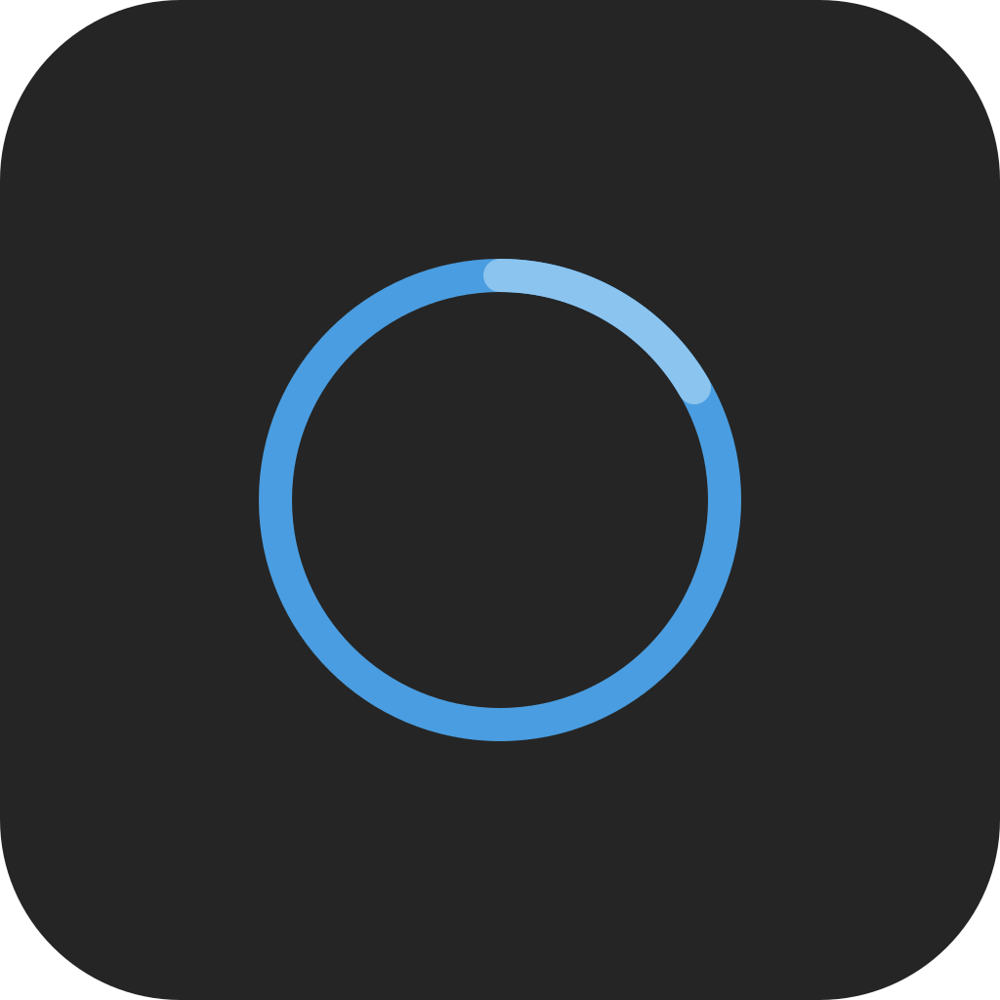
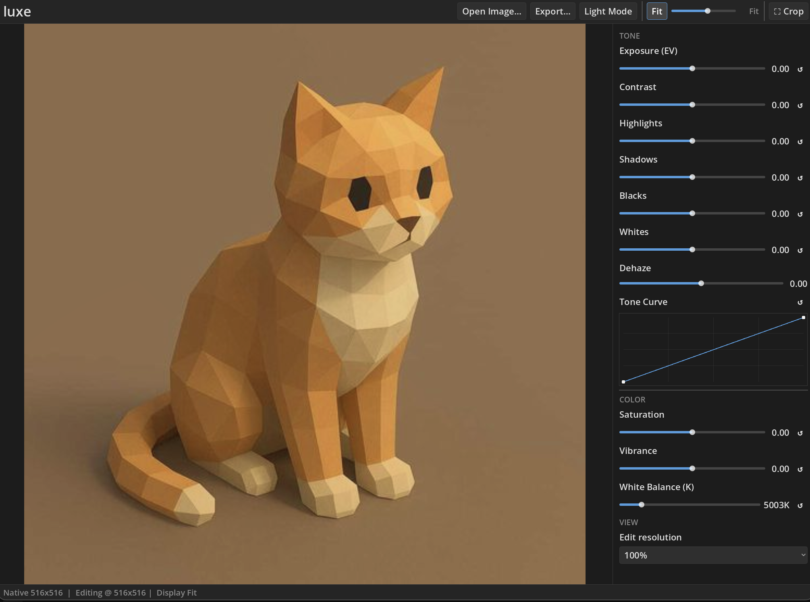
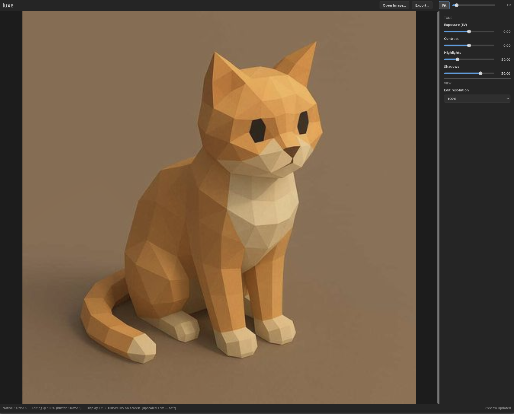
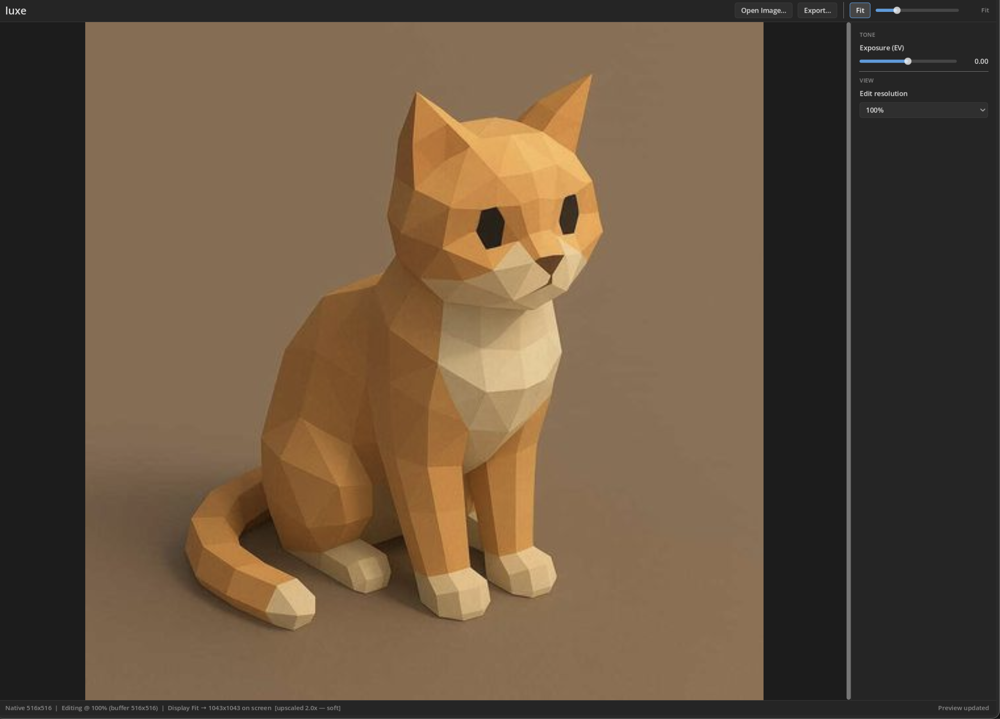
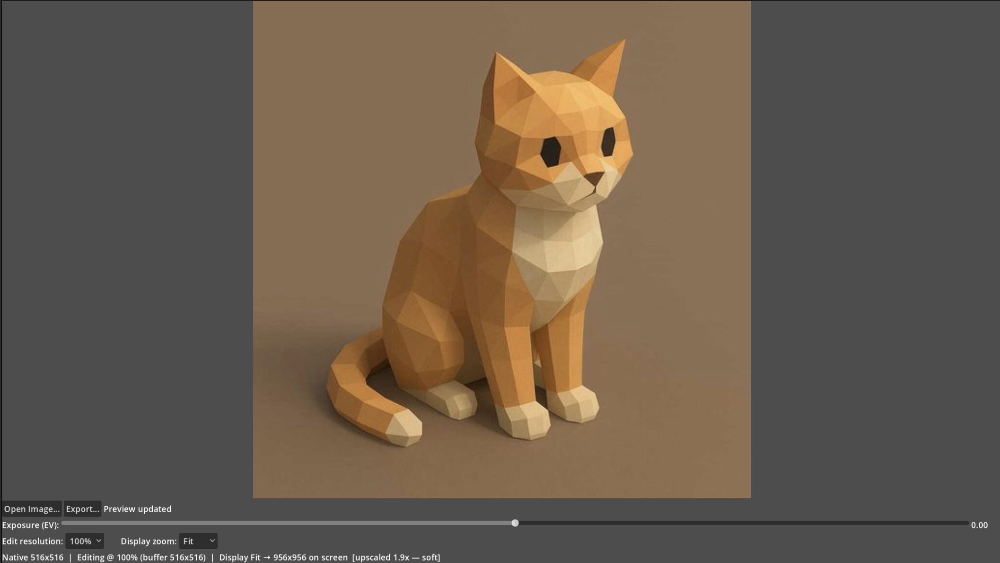
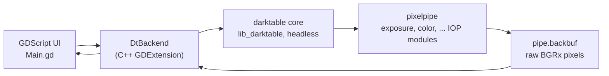

<div align="center">

<table>
<tr>
<td style="border: none; padding-right: 16px;"></td>
<td style="border: none;">
<h1>Luxe</h1>
<p><strong>A simple, opinionated RAW photo editor, powered by <a href="https://www.darktable.org/">darktable</a>'s image-processing engine.</strong></p>
</td>
</tr>
</table>

</div>

Luxe is a desktop photo editor built with [Godot 4](https://godotengine.org/). Instead of reimplementing RAW processing from scratch, it embeds darktable's real pixel pipeline in-process through a small C++ GDExtension, so every slider you drag is processed by the same code darktable's own darkroom uses.

<p align="center">
  
</p>

## Contents

- [What is Luxe](#what-is-luxe)
- [Screenshots](#screenshots)
- [Features](#features)
- [Getting started](#getting-started)
- [How it works](#how-it-works)
- [Roadmap](#roadmap)
- [Contributing](#contributing)
- [License](#license)

## What is Luxe

Luxe is a RAW photo editor with a deliberately small surface. You open a file, drag a handful of well-chosen sliders, and export. There is no module browser, no plugin marketplace, and no wall of technical settings: just the adjustments that actually move a photograph.

Under the hood it is darktable. Luxe runs darktable's core library (`lib_darktable`) inside the same process as the editor and drives its pixel pipeline directly, so the preview you see and the file you export are produced by darktable's genuine processing code, not an approximation. The frontend is Godot, which gives us a fast, GPU-accelerated, cross-platform UI shell.

The result is a small, fast editor with a serious processing engine underneath.

> Currently only support M-Series MacOS

## Features

| Adjustment    | Driven through          |
| ------------- | ----------------------- |
| Exposure      | `exposure`              |
| Contrast      | `colorbalancergb`       |
| Highlights    | `shadhi`                |
| Shadows       | `shadhi`                |
| Blacks        | `toneequal`             |
| Whites        | `toneequal`             |
| Saturation    | `velvia` + `monochrome` |
| Vibrance      | `vibrance`              |
| Tone curve    | `tonecurve`             |
| Dehaze        | `hazeremoval`           |
| White balance | `channelmixerrgb`       |
| Crop          | `clipping`              |
| Export        | darktable export engine |

The UI also gives you:

- **Edit resolution** (25% - 100%)
  - Chooses the resolution the pipeline actually processes at
  - Lower is meaningfully faster
  - Dynamically chosen to keep editing fast when importing
- **Display zoom and pan**
  - a continuous 10%-400% zoom plus Fit, decoupled from edit resolution
- **Light and dark themes**

## Progress

**v0.1.3** -- Speed up edits by 5x, add advanced sliders, add Crop
<p align="center">
  
</p>

**v0.1.2** -- Add extra sliders
<p align="center">
  
</p>

**v0.1.1** -- light/dark theme system and macOS export.
<p align="center">
  
</p>

**v0.1** -- the first editor shell: open a RAW, drag exposure, watch the preview re-render live.

<p align="center">
  
</p>

## Getting started

### Prerequisites

- **macOS on Apple Silicon** is the currently supported development platform.
- **Godot 4.6** (targets `4.6.beta3`).
- **Python 3 + [SCons](https://scons.org/)** (`pip install scons`).
- **A C++ toolchain** (Xcode Command Line Tools: `xcode-select --install`).
- **A darktable build** and **godot-cpp** (both below).

<details>
<summary>Building darktable</summary>

Luxe does not vendor darktable. Clone and build it headless so that the relative paths in `project/project.godot` resolve. The expected layout is a `source/` checkout beside `Luxe/`:

```bash
git clone https://github.com/darktable-org/darktable.git source
cmake -S source -B source/build -DUSE_GUI=OFF -DCMAKE_BUILD_TYPE=Release
cmake --build source/build
```

`-DUSE_GUI=OFF` builds darktable's image-processing core and modules with no GTK window dependency. The GDExtension links against:

- `source/build/bin/libdarktable.dylib`
- `source/build/share/darktable/` (runtime data: color profiles, etc.)
- `source/build/lib/darktable/` (IOP module plugins)

</details>

<details>
<summary>Building the GDExtension</summary>

Clone the branch matching this repo's Godot version and build both targets:

```bash
git clone --branch 4.5 --depth 1 https://github.com/godotengine/godot-cpp extension/godot-cpp
cd extension/godot-cpp
scons target=template_debug arch=arm64
scons target=template_release arch=arm64
```

Then build the C++ shim itself:

```bash
cd extension
scons arch=arm64
scons arch=arm64 target=template_release
```

The build writes compiled frameworks into `project/bin/`, which `project/dt_backend.gdextension` points at.

`extension/dt_link_flags.json` is generated per machine (gitignored, never committed): it lists the include paths, link libraries, and preprocessor defines extracted from your own darktable build. `SConstruct` reads it and, when the file is missing, runs `extension/gen_link_flags.py` to regenerate it from your build tree automatically. (The defines matter for correctness, not just compilation: darktable's headers put struct fields behind `#ifdef` guards, so a mismatched define set shifts struct offsets silently.)

</details>

<details>
<summary>Running</summary>

If your darktable checkout is not the default sibling layout, point `scons` at it:

```bash
cd extension
scons arch=arm64 \
  dt_src_dir=/path/to/darktable/src \
  dt_build_dir=/path/to/darktable/build
```

Then open `project/project.godot` in the Godot 4.6 editor, or run it directly:

```bash
godot --path project
```

A headless smoke test renders a RAW at two exposure values through the real backend and asserts the outputs differ:

```bash
scripts/smoke_test.sh                 # auto-discovers a RAW
scripts/smoke_test.sh /path/to/x.ARW  # or pin one
```

</details>

## How it works

### Architecture

Godot knows nothing about RAW processing and darktable knows nothing about Godot, so a **GDExtension** bridges them: one C++ class, `DtBackend`, that GDScript can call.

- GDScript calls plain methods like `backend.set_exposure(1.5)` or `backend.export_image("out.jpg")`.
- `DtBackend` translates each call into the actual darktable C API calls that `darktable-cli` uses internally.
- Everything runs in one process and one memory space. No sockets, no IPC, no serializing image data across a boundary.



Opening a file imports it into a throwaway in-memory darktable library (`--library :memory:`), loads it into a develop session, and builds a pixelpipe: an ordered chain of image-operation modules. Dragging a slider writes the new value into the relevant module's params, commits it to the history stack, and re-runs the pipe. The result is read back from the pipe's output buffer, byte-swapped to RGBA, and handed to Godot as a texture.

The pipeline runs on a worker thread so the UI stays responsive, and live previews render through a lower-resolution preview pipe while exports always render full resolution. darktable's core state is a single global per process, so `DtBackend` holds one image session at a time.

## Roadmap

- Wire up more darktable IOP modules. Modules with masks, drawn shapes, splines, or color pickers need real custom UI first.
- A universal (arm64 + x86_64) GDExtension build.

## Contributing

Contributions are welcome. See [`CONTRIBUTING.md`](CONTRIBUTING.md) for the full guide. The short version:

1. Read [Getting started](#getting-started) and build darktable, godot-cpp, and the GDExtension.
2. Run `scripts/smoke_test.sh` to confirm the pipeline works end to end.
3. Install the tracked git hooks once after cloning: `scripts/install-hooks.sh` (the pre-commit hook rebuilds the GDExtension when its sources change and aborts the commit on a build failure).
4. Keep changes focused, make sure the smoke test passes, and explain the "why" in the commit message.

## License

Luxe is free software, released under the **GNU General Public License, version 3 or (at your option) any later version** (`GPL-3.0-or-later`). See [`LICENSE`](LICENSE) for the full text.

- **darktable**, which Luxe embeds and links against as its image-processing engine, is licensed under GPL-3.0 (see [`NOTICE`](NOTICE)).
- **godot-cpp**, which provides the C++ bindings for the GDExtension, is licensed under the MIT License and is not covered by Luxe's GPL-3.0 licensing.

Because Luxe links against GPLv3 darktable, the combined work is distributed under the GPL. By contributing, you agree to license your contributions under GPL-3.0-or-later.
