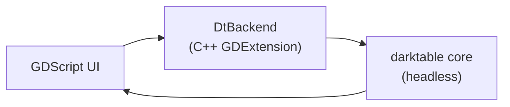

<div align="center">

<table>
<tr>
<td style="border: none; padding-right: 16px;"></td>
<td style="border: none;">
<h1>Luxe</h1>
<p><strong>A simple, opinionated RAW photo editor, powered by <a href="https://www.darktable.org/">darktable</a>'s image-processing engine.</strong></p>
</td>
</tr>
</table>

</div>

Luxe is a desktop photo editor built with [Godot 4](https://godotengine.org/). Instead of reimplementing RAW processing from scratch, it embeds darktable's real pixel pipeline in-process through a small C++ GDExtension, so every slider you drag is processed by the same code darktable's own darkroom uses.

<p align="center">
  
</p>

## Contents

- [What is Luxe](#what-is-luxe)
- [Screenshots](#screenshots)
- [Features](#features)
- [Getting started](#getting-started)
- [How it works](#how-it-works)
- [Roadmap](#roadmap)
- [Contributing](#contributing)
- [License](#license)

## What is Luxe

Luxe is a RAW photo editor with a deliberately small surface. You open a file, drag a handful of well-chosen sliders, and export. There is no module browser, no plugin marketplace, and no wall of technical settings: just the adjustments that actually move a photograph.

Under the hood it is darktable. Luxe runs darktable's core library (`lib_darktable`) inside the same process as the editor and drives its pixel pipeline directly, so the preview you see and the file you export are produced by darktable's genuine processing code, not an approximation. The frontend is Godot, which gives us a fast, GPU-accelerated, cross-platform UI shell.

The result is a small, fast editor with a serious processing engine underneath.

> Currently only support M-Series MacOS

## Features

- Exposure
- Contrast
- Highlights
- Shadows
- Blacks
- Whites
- Saturation
- Vibrance
- Tone curve
- Dehaze
- White balance
- Crop
- Export

The UI also gives you:

- **Edit resolution** (25% - 100%)
  - Chooses the resolution the pipeline actually processes at
  - Lower is meaningfully faster
  - Dynamically chosen to keep editing fast when importing
- **Display zoom and pan**
  - a continuous 10%-400% zoom plus Fit, decoupled from edit resolution
- **Light and dark themes**

## Progress

**v0.1.3** -- Speed up edits by 5x, add advanced sliders, add Crop

<p align="center">
  
</p>

**v0.1.2** -- Add extra sliders

<p align="center">
  
</p>

**v0.1.1** -- light/dark theme system and macOS export.

<p align="center">
  
</p>

**v0.1** -- the first editor shell: open a RAW, drag exposure, watch the preview re-render live.

<p align="center">
  
</p>

## Getting started

### Prerequisites

- **macOS on Apple Silicon** is the currently supported development platform.
- **Godot 4.6** (targets `4.6.beta3`).
- **Python 3 + [SCons](https://scons.org/)** (`pip install scons`).
- **A C++ toolchain** (Xcode Command Line Tools: `xcode-select --install`).
- **A darktable build** and **godot-cpp**

**Building darktable**

Luxe does not vendor darktable; the extension is built against your own darktable checkout. Build a headless configuration of darktable from source (see darktable's build docs) and place the checkout as a `source/` directory beside this repo, so the relative paths in `project/project.godot` resolve.

**Building the GDExtension**

Clone the branch matching this repo's Godot version and build both targets:

```bash
git clone --branch 4.5 --depth 1 https://github.com/godotengine/godot-cpp extension/godot-cpp
cd extension/godot-cpp
scons target=template_debug arch=arm64
```

Then build the C++ shim itself:

```bash
cd extension
scons arch=arm64
scons arch=arm64 target=template_debug
```

The build writes compiled frameworks into `project/bin/`, which `project/dt_backend.gdextension` points at.

## How it works

### Architecture

Godot knows nothing about RAW processing and darktable knows nothing about Godot, so a **GDExtension** bridges them: one C++ class, `DtBackend`, that GDScript can call.

- GDScript calls plain methods like `backend.set_exposure(1.5)` or `backend.export_image("out.jpg")`.
- `DtBackend` translates each call into the actual darktable C API calls that `darktable-cli` uses internally.
- Everything runs in one process and one memory space. No sockets, no IPC, no serializing image data across a boundary.



The internals of the bridge are not documented here; read the source if you're curious. It is single-session (one image open at a time) and keeps the UI responsive while the pipeline runs.

## Roadmap

- More adjustments: selected darktable IOP modules plus purpose-built Luxe tools. Darktable modules with masks, drawn shapes, splines, or color pickers need real custom UI first.
- A universal (arm64 + x86_64) GDExtension build.

## Contributing

Contributions are welcome. See [`CONTRIBUTING.md`](CONTRIBUTING.md) for the full guide. The short version:

1. Read [Getting started](#getting-started) and build darktable, godot-cpp, and the GDExtension.
2. Run `scripts/smoke_test.sh` to confirm the pipeline works end to end.
3. Install the tracked git hooks once after cloning: `scripts/install-hooks.sh` (the pre-commit hook rebuilds the GDExtension when its sources change and aborts the commit on a build failure).
4. Keep changes focused, make sure the smoke test passes, and explain the "why" in the commit message.

## License

Luxe is free software, released under the **GNU General Public License, version 3 or (at your option) any later version** (`GPL-3.0-or-later`). See [`LICENSE`](LICENSE) for the full text.

- **darktable**, which Luxe embeds and links against as its image-processing engine, is licensed under GPL-3.0 (see [`NOTICE`](NOTICE)).
- **godot-cpp**, which provides the C++ bindings for the GDExtension, is licensed under the MIT License and is not covered by Luxe's GPL-3.0 licensing.

Because Luxe links against GPLv3 darktable, the combined work is distributed under the GPL. By contributing, you agree to license your contributions under GPL-3.0-or-later.
